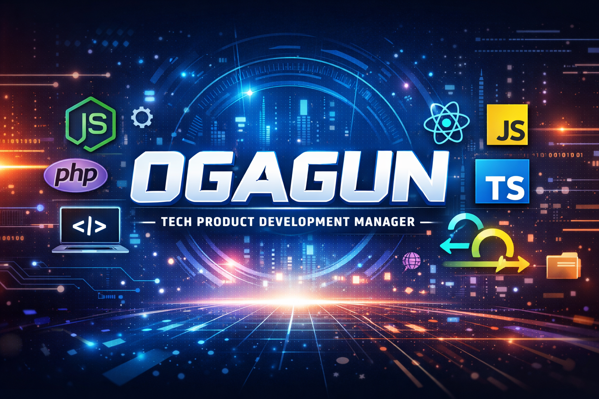
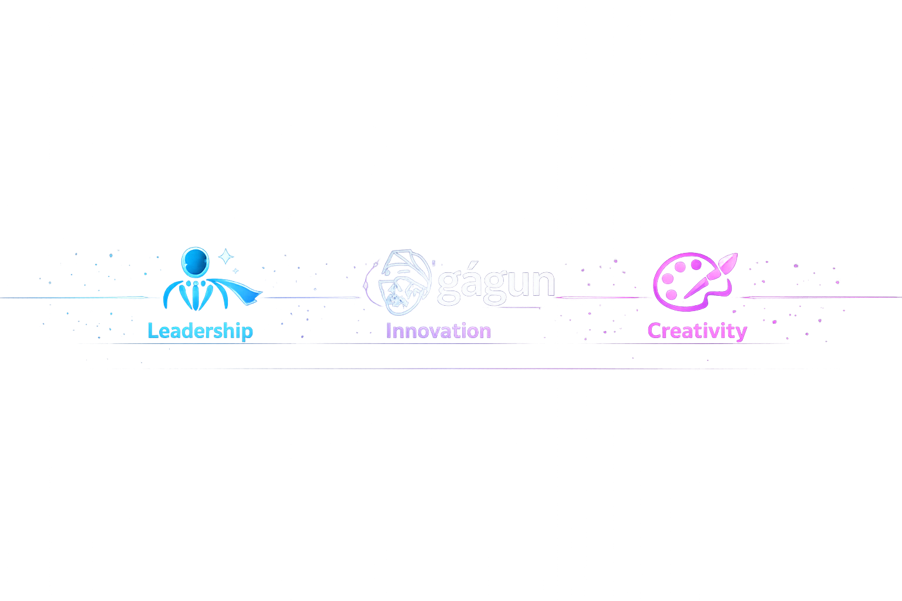
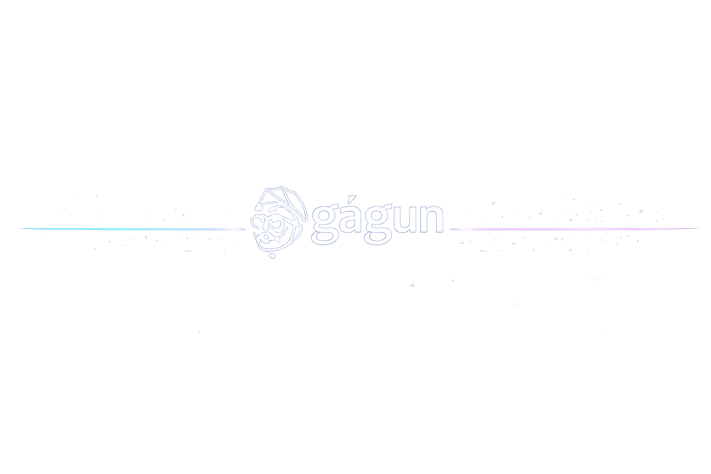

  

  

<h1 align="center">Hi there 👋 I'm Mathew Oguntayo (OGAGUN)</h1>
<h3 align="center">Technical Product Development Manager | Team Lead | Agile & Waterfall Practitioner</h3>

---

### 🚀 About Me
With 10+ years of experience driving product development, leading cross‑functional teams, and delivering innovative solutions. I’m passionate about technology, collaboration, and continuous improvement — blending creativity with strategy to build impactful products.

---

  

---

### 🛠️ Tech & Tools
**Languages & Frameworks:**

**Databases:**

**Cloud & Infrastructure:**

**DevOps & Tools:**

**Collaboration & Design:**

---

  

---

### 📌 Featured Projects
- [**Spectra‑Code‑Reviewer**](https://github.com/ogagunmathew/Spectra-Code-Reviewer) – Automated code review tool for teams  
- [**Agency‑Agents**](https://github.com/ogagunmathew/agency-agents) – AI‑powered workflow optimization  
- [**Portfolio Website**](https://github.com/ogagunmathew/portfolio) – Personal portfolio showcasing projects  

---

  

---

### 📊 GitHub Stats

---

  

---

### ✨ Dynamic Extras

---

### 🎯 Beyond Work
- ⚽ Arsenal fan  
- 🎶 Music lover  
- 🎬 Movie enthusiast  

---

📫 **Connect with me:**
- [LinkedIn](https://linkedin.com/in/mathewkunle)  
- [Brand](https://bluespectra.com)  
- [Email](mailto:mathew@bluespectra.com)

---

  

